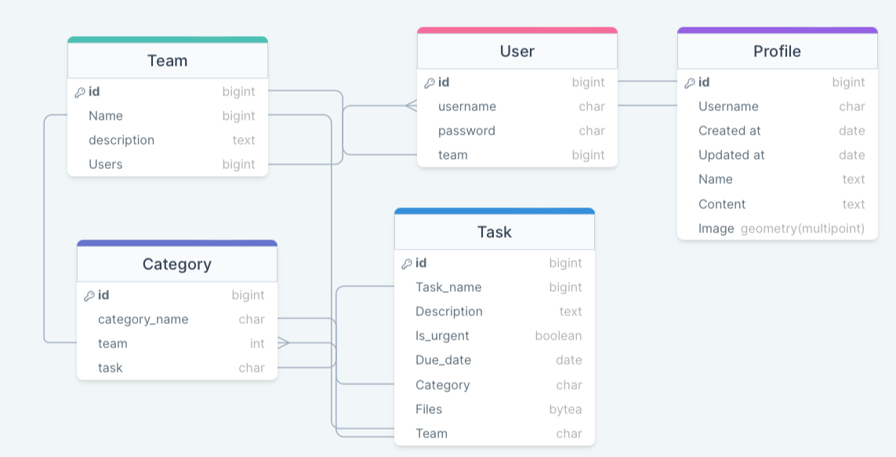
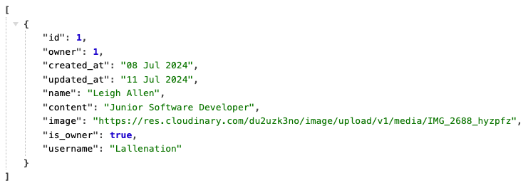

# ProductiveYou API
Code Institute PP05 Back-End
## Project Overview
### Description
ProductiveYou is a productivity app that allows users to create profiles, add each other to teams and collaborate on tasks.

This project utilizes Django’s Rest Framework to create API’s for a team productivity app I have developed as a separate project, this can be viewed here - [ProductiveYou React](https://github.com/LeighAllenDev/React-ProductiveYou). It allows users to register an account, save login information, create teams, add and edit categories and create tasks, also allowing the tasks to be assigned to other users. 

This is all achieved through the use of the Rest Framework to create a complete back-end with full CRUD functionality which allows users to Create, Read, Update and Delete tasks, categories and teams.
## Table of Contents
1. [Project Overview](#project-overview)
    * [Description](#description)
    * [Purpose and Goals](#purpose-and-goals)
2. [API overview](#api-overview)
    * [API Endpoints](#api-endpoints)
    * [Database Design](#database-design)
    * [JSON](#json)
3. [Security Measures](#security-measures)
    * [Authentication](#authentication)
4. [Code Standards and Practices](#code-standards-and-practices)
5. [Testing and Version Control](#testing-and-version-control)
    * [Manual Testing](#manual-testing)
    * [Version Control](#version-control)
6. [Deployment](#deployment-to-heroku)
7. [Credits](#credits)

### Purpose and Goals

The purpose of this project is to build a backend system that utilizes the Django Rest Framework and provides an API for a team productivity and task manager app that I have developed in react to work along side this.

The goal is to provide everything in the API that the front end may need, allowing users to register, log in and out, add and delete tasks and categories as well as assigning them to other users and even uploading files and images within the tasks.

## API Overview

This project is set up using the Django Rest Framework, a django library for the back-end. The code is written in the Python programming language and the IDE I used was GitPod which is similar to an online version of Visual Studio Code. 

### API Endpoints

The API endpoint routes used in this project are as follows:

- ‘’ - This is the root_route, links to the base page of the app, the user is greeted with a welcome message.
- ‘admin/’ - This is the link for the admin page, where admin users can view all of the information on the database, it allows trusted users to fetch user data as well as update their records.
- ‘api-auth/’ - this is the base of the rest_framework urls which allows the API to function, it handles the user accounts and social aspects.
- ‘dj-rest-auth/’ - This url handles the security of the app allowing registered users to log in to their account. This allows the user to fetch data linked to their login username.
- ‘dj-rest-auth/logout/’ - This url handles the users ability to log out and save their state
- ‘dj-rest-auth/registration/’ - This url allows new users to register to the app and create an account,
- ‘profiles/’ - This is the base for the profiles urls for updating user information on the database.
    - ‘’ - This url shows a list of all registered users to the app
    - ‘/<int:pk>/’ - This url shows single profile pages with the use of <int:pk> linking to the primary key which is the users id
- ‘api/’ - This contains the urls linked to the tasks
    - ‘tasks/’ - This shows a list of all assigned tasks
    - ‘tasks/<int:pk>/’ - This is used similarly to the profiles page where single tasks are displayed
    - ‘categories/’ - This links all the categories the user has saved on a database
    - ‘categories/<int:pk>’ - This lists individual categories in the database
- ‘teams/’ - This contains the relevant urls for adding and editing teams
    - ‘teams/’ - The team list view
    - ‘teams/<int:pk>/ - this contains the team detail view where pk is the primary key referring to the teams id.
### Database Design
For this project, the database has 5 main tables that connect through sql with each of them containing specific models and columns for the database. The database models can be seen in my **Entity Relationship Diagram** seen below, Also provided is a link to the site. [DrawSql Model](https://drawsql.app/teams/code-institute-24/diagrams/productivity-app)

### JSON
JSON is used to to convert the posted data in the front-end to a format that the api can read. for instance a profile will be looking for specific data such as: {"profile"} an example of a successful response looks like this: 
The JSON data is created wit the help of Serializers, which take in the data being provided in the front end, if all fields match the serializers then manipulate this data in to JSON through the API which can then be read by the django backend and update the information on the database based on what data is provided in the serializers.
## Security Measures
During the development of a Django project I set up an **env.py** file. this will show any databases I may link to the project as well as any secret keys, by providing them in this file they are available while developing the app but the file is not stored on GitHub so none of these will leak once the project is deployed.

In the base *setting.py* file for the all the os is imported and there are measures to allow the project to access the information contained in the env file without revealing it in the code for the deployed app. Once the project is deployed, these config variables are then accessible through the settings within the app so they can be accessed in the background by the host domain (heroku) while still being hidden from the code. This helps keep the databases and over variables secure so they cannot appear in data leaks.

The Project also incorportates Django’s AllAuth framework that allows for users to register an account and keep their information safe, this in turn prevents other users from accessing personal information for other users and lets them only manage tasks, teams and profiles that they have personally created.

The project is set up in a way that the *settings.py* file is provided with a list of allowed hosts to limit use of the app and make sure that you are a trusted user before adding to the database or using the app.

### Authentication

Authentication is handled by Django Rest Framework’s AllAuth which provides python logic for registering, signing in and looking out, this helps prevent unauthenticated users accessing sensitive content. When a user registers an account it triggers the permissions and gives them access as long as they are logged in. If they log out they will not be able to view or edit any of the fields in the database.

The project utilizes token based JWT which handles allowed hosts and also includes cors headers which stands for Cross Origin Resource Sharing, this enables front ends such as a react project to access and manipulate the date within this api with relevant permissions. This means that only verified users on trusted domains can access this information.

## Code Standards And Practices
When writing the code in Django I follow the PEP8 guidelines and coding standards to make sure my code is clean, easy to read and consistent.

A brief summary of the **PEP8 Coding Standards** is as follows:

- **Indentation** - PEP8 advises there should be 4 spaces per indentation, this can also be achieved with the TAB key, any continuation lines should be aligned to their wrapped elements either with a hanging indent or or vertically wrapped.
- **Naming Variables** - PEP8 guidelines state to follow descriptive and consistent naming for all variables, functions and classes. This helps improve readability for everyone seeing or editing the code and reduces any potential confusion.
- **Line Length** - To comply with the PEP8 guidelines each line of code is limited to 79 characters while comments and docstrings are limited to 72 characters.
- **Whitespace** - There should be minimal whitespace, this is to help enhance code readability.
- **Comments and Docstrings** - PEP8 guidelines suggest that comments and docstrings should be informative and descriptive to improve readability and potential collaboration with other developers.

By following these guidelines I can be sure that my code is written effectively and using coding standards best practices to make my code easy to read and understand for anyone else that may see the source code.

## Testing and Version Control

### Manual Testing
Testing the API can be managed in a few ways, through the django terminal commant “python3 manage.py runserver” if there are issues these will be displayed in the terminal, normally with the location of the code that is causing an issue. 

As well as this, when the live server is running you can access all of the api endpoints and see if they are holding the correct information, and any error messages will be shown here. When deployed to heroku this also works and it will load raw JSON data as touched on above in the example.

Django has an admin page, after creating a super user I am able to load the backend each time I add a model to make sure that it is visible and working in the admin panel. 

### Version Control
During the development of this API project I have continually used GitHub and Git for version control. With every project, there are huge benefits to using version control such as Git when developing a project, some examples are:
- Collaboration - Git allows multiple developers to work on the same project simultaneously without the risk of overwriting each overs changed. This allows each developer to work on separate branches and it can be merged together when they have finished.
- Keeping track of history - When using Git there are a number of commit message conventions that I try to follow as closely as possible. These help keep changes clear and easy for other developers to see.

It is also important when using Git to make sure you follow the best practices which are as follows:
* To make incremental, small changes, commiting frequently with small changes avoids large commits that could have many issues in them
* Use of descriptive commit messages, writing clear commit message help explain the purpose of each change
* Identifying a branching strategy for a project, using a framework can help managing and creating branches effectively.
* Dont break builds, you should ensure that the changes you're about to commit wont break the existing codebase and run tests to verify everything is working before committing.
* Review code before committing, similarly to the above, if colaborating work with the team to make sure there are no errors in the code about to be committed
* Ensuring tracable commits meaning that each commit should be able to identify a specific issue or feature.

## Deployment to Heroku
To deploy this project to heroku I use following process, here are the steps:
- Log in to Heroku
- Click the **New** button at the top right of the page
- Select **Create new app** in the dropdown menu
- Choose a unique name for the project: **productive-you-api**
- Select the region for the app then click **Create App**
- Once created, click on the **Settings** tab in the menu and click the button that says **Reveal Convig Vars**
- In the **convig vars** I set the following with their sensitive information which I won’t include here:
    - DATABASE_URL
    - CLOUDINARY_URL
    - SECRET_KEY
    - DISSABLE_COLLECTSTATIC
- Once that is save, on the menu select **Deploy**
- On the *Deployment Method* section, select **GitHub** and connect to your **GitHub account**
- Search through the repositories and find the one that matches this project - **ProductiveYouAPI**
- at the bottom of the page, click on the **Deploy** button.
## Credits
This project is heavily based on the drf-api walk through project on in the Code Institute course material in the Django Rest Framework module.
- Code Institute
- Django Documentation
- DRF Documentation
- Python Documentation
- Microsoft CoPilot
- ChatGPT